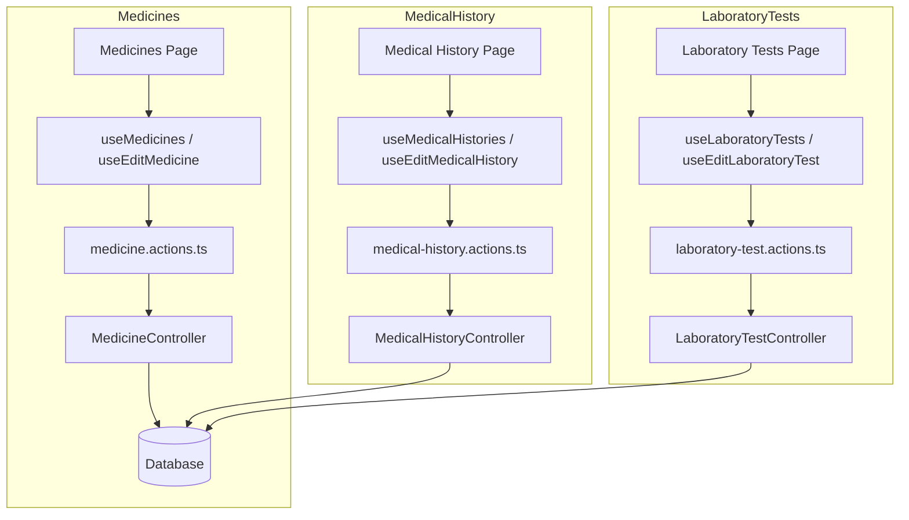

```mermaid

flowchart TD
subgraph Medicines
MP["Medicines Page"] --> MH["useMedicines / useEditMedicine"]
MH --> MA["medicine.actions.ts"]
MA --> MC["MedicineController"]
MC --> DB[(Database)]
end

subgraph MedicalHistory
HP["Medical History Page"] --> HH["useMedicalHistories / useEditMedicalHistory"]
HH --> HA["medical-history.actions.ts"]
HA --> HC["MedicalHistoryController"]
HC --> DB
end

subgraph LaboratoryTests
LP["Laboratory Tests Page"] --> LH["useLaboratoryTests / useEditLaboratoryTest"]
LH --> LA["laboratory-test.actions.ts"]
LA --> LC["LaboratoryTestController"]
LC --> DB
end

```
